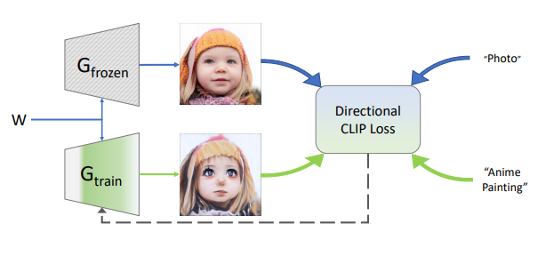
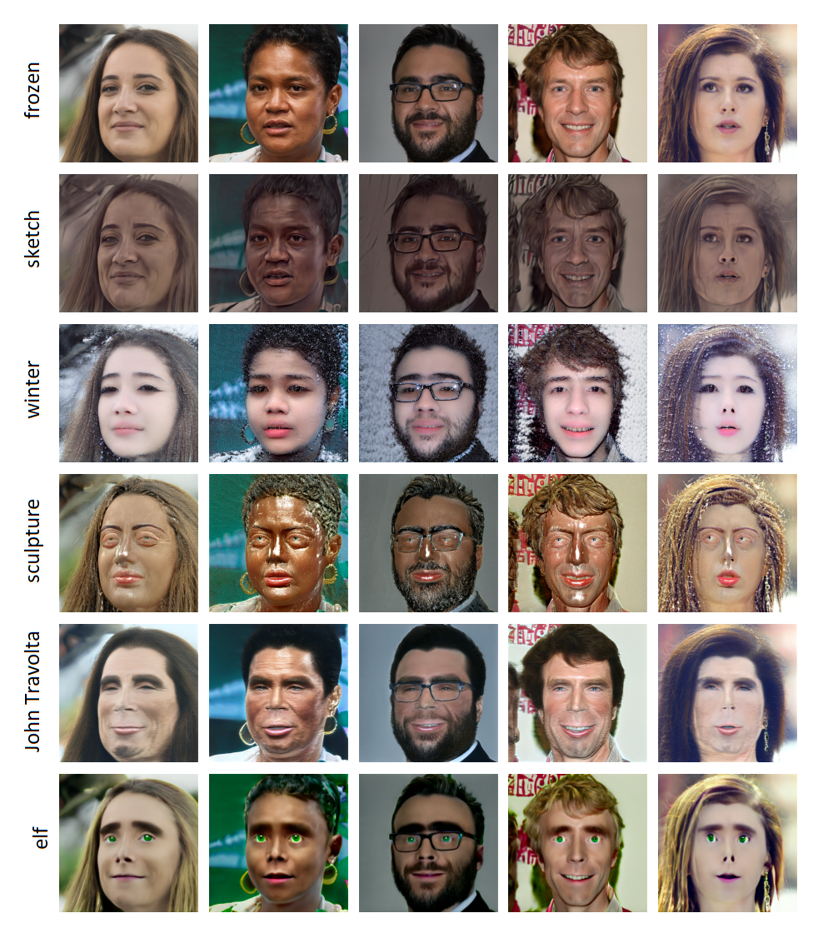
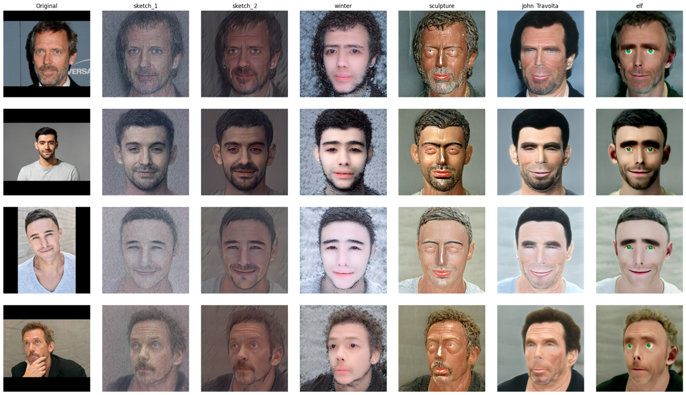

# Toolkit for StyleGAN-NADA: CLIP-Guided Domain Adaptation of Image Generators

### О проекте
Данный проект предоставляет полный пайплайн для инверсии и стилизации изображений с использованием кастомно обученных генераторов StyleGAN-NADA. Он автоматизирует настройку модели, предобработку, энкодинг и перенос стиля с использованием манипуляции скрытым пространством под управлением CLIP. Данный проект является реимплементацией StyleGAN-NADA на основе статьи: [https://arxiv.org/pdf/2108.00946](https://arxiv.org/pdf/2108.00946)

### Особенности
* **Text-Guided Fine-Tuning (Тонкая настройка по текстовому описанию):** Адаптация генератора StyleGAN2 к новому домену с использованием только текстовых подсказок, например "картина" или "карандашный набросок".
* **Directional CLIP Loss (Направленная функция потерь CLIP):** Кастомная функция потерь выравнивает направление изменения изображения в пространстве CLIP с направлением изменения текста, обеспечивая точный семантический контроль.
* **Dynamic Loss Coefficient Adjustment (Динамическая корректировка коэффициентов потерь):** Независимый оптимизатор автоматически корректирует веса потерь ($\lambda_{CLIP}$ и $\lambda_{L2}$) для достижения баланса между трансформацией стиля и сохранением контента.
* **Adaptive Layer Freezing (Адаптивная заморозка слоев) :** Новый метод автоматического определения и разморозки только самых релевантных слоев генератора для конкретной задачи, что повышает эффективность обучения и качество результатов.
* **Real Image Editing (Редактирование реальных изображений):** Метод можно комбинировать с техниками инверсии изображений для редактирования реальных фотографий.

### Процесс обучения
В обучении участвуют две копии генератора:
* **Замороженный (frozen) генератор**, который всегда производит базовые изображения из исходного домена.
* **Обучаемый (trainable) генератор**, инициализированный идентично замороженному, но обновляемый для соответствия новому домену.

CLIP используется для управления направлением редактирования. Идея заключается в выравнивании CLIP-направления (разницы в эмбеддингах) между изображениями, сгенерированными двумя генераторами, и направлением между исходным и целевым текстовыми описаниями.

 `01_train.ipynb`

### Эксперименты и результаты
В нашем исследовании мы изучили несколько ключевых аспектов метода StyleGAN-NADA:
1.  **Adaptive vs. Static Layer Freezing**
2.  **Granular Freezing Techniques**
3.  **Dynamic Source Text Selection**
4.  **Dynamic Loss Weighting**

 `03_experiments.ipynb`

---

### Начало работы
**Требования**
* Google Colaboratory (рекомендуется)
* Доступ к GPU (бесплатная версия Colab или Pro)
* Runtime -> Run all
* Все необходимые предобученные модели скачаются автоматически
* **Важно:** Убедитесь, что обновили ID файлов Google Drive в словаре `stylegan_nada_generators` для загрузки ваших собственных генераторов.

**Примеры:**

### Подготовка изображений для инверсии
1.  Поместите ваши изображения в форматах `.png`, `.jpg` или `.jpeg` в следующую папку: `/data/inversion/`
2.  Вы можете перетаскивать изображения прямо в панель файлов Colab.

### Как это работает
После запуска всех ячеек:
* Будут сгенерированы несколько случайных примеров с использованием первого доступного генератора.
* Будут обработаны все изображения, найденные в папке `/data/inversion/`:
    * Выравнивание лица (Face alignment) -> Кодирование в скрытое пространство (Latent encoding) -> Стилизация
    * Будет отображено визуальное сравнение между оригинальными и стилизованными изображениями.

 `02_inference.ipynb`

### Заключение
Показано, что StyleGAN-NADA является мощным фреймворком для zero-shot генеративного редактирования изображений. Имея только текстовую подсказку, генератор можно адаптировать для синтеза изображений в новых доменах — включая фантастические или художественные стили — без необходимости использования целевых данных.
